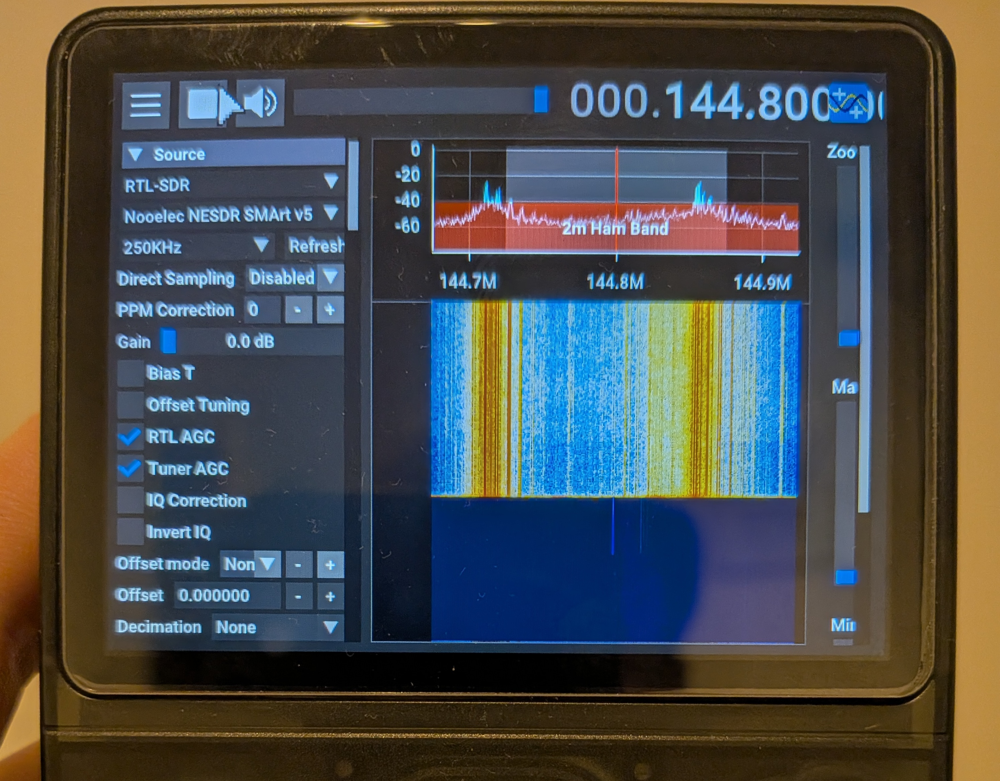

# SDR++ for PortMaster (R36S and friends)



A reproducible build pipeline that turns upstream
[SDR++](https://github.com/AlexandreRouma/SDRPlusPlus) into a
[PortMaster](https://portmaster.games/)-installable port for RK3326-class Linux
handhelds — the R36S in particular.

```bash
make            # build, smoke test, package -> dist/sdrpp.zip
```

That's the whole thing. Everything below is why it's shaped this way.

---

## The problem

SDR++ is a desktop application. It expects GLFW, a window system, desktop
OpenGL, a mouse and a 1280x720 screen. An R36S has none of those: a 1.3 GHz
quad Cortex-A35, 1 GB of RAM, a 640x480 panel, a Mali-G31 behind ARM's
proprietary blob, no X server, no compositor, and a gamepad.

Three separate gaps, each closed differently:

**No window system, no desktop GL.** PortMaster's
[Westonpack](https://github.com/binarycounter/Westonpack) runtime
(`weston_pkg_0.2`) exists precisely for this: it supplies Weston, Xwayland,
X11 client libraries, and GL 2.1 via GL4ES on top of GLES. The launcher runs
SDR++ through `westonwrap.sh` in `headless noop kiosk crusty_glx_gl4es` mode —
GLX faked over SDL2, no real compositor, which is what works on Mali-blob
devices.

The build itself needs no patches, which is the pleasant surprise here.
SDR++'s GLFW backend already walks a fallback ladder — desktop GL 3.0, then
GLES 3.1, then GL 2.1 — and every version it tries uses GLSL 1.20 or ES 3.00.
GL4ES lands on the GL 2.1 rung. The only direct GL calls SDR++ makes outside
of Dear ImGui are texture uploads in the waterfall widget, all of which are
fine under GL 2.1.

**No mouse.** SDR++ has no gamepad support at all, so gptokeyb maps the left
stick to a pointer, with a slow modifier and single-step nudging for hitting
narrow targets like VFO edges. See `port/sdrpp/sdrpp.gptk.*`.

**Desktop-scale defaults.** A 65536-point FFT at 20 fps will not run on this
SoC. The launcher seeds a device-appropriate `config.json` on first run —
8192-point FFT, 15 fps, window and menu sized from `$DISPLAY_WIDTH`/`$DISPLAY_HEIGHT`
— and then leaves the user's settings alone forever after.

## How the build works

| Stage | Where | What |
|---|---|---|
| `make image` | host | Builds `docker/Dockerfile` on top of the official PortMaster aarch64 builder |
| `make build` | container | Clones SDR++, compiles, stages a relocatable tree into `build/sdrpp/` |
| `make smoke` | container | Runs the staged binary under Xvfb + llvmpipe and asserts it starts |
| `make package` | host | Assembles `dist/sdrpp.zip` |

### Why this base image

`ghcr.io/monkeyx-net/portmaster-build-templates/portmaster-builder:aarch64-latest`
is Ubuntu 20.04 — glibc 2.31, gcc 9.4. That is not an arbitrary choice: ArkOS
on RK3326 is focal-era, and a binary linked against a newer glibc simply
refuses to start there. Build on the oldest target you intend to support.

### Native, not emulated

The container is `linux/arm64` and the build runs natively on Apple Silicon and
ARM Linux hosts — no QEMU, which is worth roughly an order of magnitude in
compile time. On an x86_64 host, run `make binfmt` once first; everything else
is identical, just slower.

### Library bundling

`scripts/bundle-libs.sh` walks the dependency graph from the binary and every
module, copies what it finds into `libs.aarch64/`, and rewrites RUNPATHs to
`$ORIGIN`-relative paths so the port works whether it lands in `/roms/ports` or
`/roms2/ports`.

It deliberately does **not** bundle four categories:

* **glibc core** — must be the device's own loader
* **X11 / Wayland client libs** — Westonpack ships these in `lib_aarch64/`
* **GL / EGL / GLES / GBM / DRM** — whichever `gl_library` mode you pick
  provides them; shadowing them is the classic route to a black screen
* **ALSA** — `libasound` drags in device-specific plugin configuration

RUNPATH rather than RPATH is intentional: `LD_LIBRARY_PATH` still wins, which
leaves an escape hatch if some firmware needs its own copy of something.

The script fails the build on any unresolved `NEEDED` entry, because the
alternative is discovering it as a port that silently does nothing.

### The smoke test

`make smoke` launches the real aarch64 binary under Xvfb with llvmpipe and
asserts: everything is aarch64, every library resolves through RUNPATH alone,
a GL context is created, every shipped module appears in the log, and no load
errors occur.

It cannot tell you anything about GL4ES, Westonpack, gptokeyb or actual
performance — only the device can. What it does catch, in about a minute and
without touching hardware, is the whole class of bundles that cannot start at
all. Most of the iteration loop for a port like this lives here.

## Configuration

| Variable | Default | Purpose |
|---|---|---|
| `SDRPP_REF` | `master` | Upstream git ref to build. Pin a tag for releases. |
| `SDRPP_CMAKE_EXTRA` | — | Extra `-D` flags, e.g. to re-enable a module |
| `PORTER` | `Unknown` | Your name; written into `port.json` |
| `JOBS` | host CPU count | Parallel compile jobs |
| `PLATFORM` | `linux/arm64` | Container platform |
| `GH_USER` / `GH_REPO` | `jasiek` / `r36s-sdrplusplus` | Where the source manifests point |
| `TAG` | `latest` | Release tag used in `ports.json` download URLs |

```bash
make SDRPP_REF=1.2.1 PORTER="Your Name"
```

The enabled module set lives in `scripts/build.sh` and is trimmed for this
hardware: RTL-SDR, Airspy, AirspyHF+, HackRF and the network sources are in;
SoapySDR, LimeSDR, BladeRF, USRP, the satellite decoders and Discord presence
are out.

## Testing on the device

The R36S has **no built-in WiFi** (only the 2025 "R36S Plus" does) and one
usable USB-C OTG port. That single port is the crux of the whole setup: a WiFi
dongle and an SDR dongle both want it, and an RTL-SDR draws ~300 mA which is at
or past what the port supplies unassisted. **A powered OTG hub solves both
problems at once** and is the single most useful thing to have.

SDR++ renders through the `weston_pkg_0.2` runtime, and something has to put
that runtime on the device. **`make deploy` now does it for you** — it checks
`PortMaster/libs/`, verifies the md5, and installs the runtime if it is missing
or damaged, fetching it on the handheld when that has a route to the internet
and through the SSH link when it doesn't.

Do not count on PortMaster fetching it by itself. That download goes through
`harbourmaster`, which is the first part of an ageing PortMaster install to
break, and when it breaks the port dies at the mount with nothing in the log
but `special device ... does not exist`. If you are installing by hand rather
than with `make deploy`, download
[`weston_pkg_0.2.aarch64.squashfs`](https://github.com/PortsMaster/PortMaster-New/raw/main/runtimes/weston_pkg_0.2.aarch64.squashfs)
and save it as `weston_pkg_0.2.squashfs` (the generic name, which is what the
launcher looks for) in `PortMaster/libs/`.

### Artwork

`port/cover.png` is original art, rendered from `port/cover.svg`.

`port/screenshot.png` can be produced two ways:

```bash
make screenshot                                    # host, under Xvfb
make device-screenshot DEVICE=ark@192.168.1.50     # the handheld's own panel
```

`make screenshot` runs the real aarch64 binary under Xvfb at 640x480 and grabs
the framebuffer. It is a genuine render of the real application at the real
resolution, which makes it fine for the source listing.

`make device-screenshot` launches the port on the device, waits for SDR++ to
report itself ready, grabs the panel and tears weston down again — but **it
does not work on an R36S**, and the failure is in the kernel rather than the
script. The 4.4 vendor kernel exposes `/dev/fb0` as DRM fbdev emulation that is
never scanned out (`smem_start 0x0`, reads back all zeroes, while
`/sys/kernel/debug/dri/0/summary` shows the VOP scanning out a different
address); `ffmpeg -f kmsgrab` finds the active plane but cannot get a handle to
it, because the buffer belongs to crusty as DRM master and 4.4 predates
`drmModeGetFB2`; `/dev/mem` is refused by `CONFIG_STRICT_DEVMEM`; and the
firmware ships no screenshot tool. PortMaster's submission rules want a capture
taken on the handheld including any letterboxing, so on this hardware that
means **a photograph of the device**. The script is kept for handhelds whose
firmware leaves fbcon on the CRTC, where the fbdev path does work.

The host capture is what first revealed the layout clipping documented in the
port README, and the photograph at the top of this file confirms it on the
panel: the frequency readout and the right-hand slider labels don't fit at
640x480, and no config setting fixes it, because SDR++ only accepts UI scales
of 100/200/300/400% — `display.cpp` looks the value up in a fixed list and
throws an uncaught exception on anything else.

### Fast iteration

Reinstalling through PortMaster for every change is a miserable loop for the
part of this port that actually needs iterating. With SSH reachable — ArkOS
enables it by default, and there's an `SSH Over OTG.sh` port if you have no
WiFi dongle:

```bash
make deploy DEVICE=ark@192.168.1.50   # copies only what changed, keeps conf/
make logs   DEVICE=ark@192.168.1.50   # pulls log.txt back
```

Launch from the Ports menu between the two.

`deploy` produces a *runnable* install, not just a file copy. On top of the
port tree it places `port.json` and `gameinfo.xml` inside the port folder,
where a PortMaster install puts them and where EmulationStation looks for the
cover art, and it makes sure the Westonpack runtime is present and intact. It
depends on `package`, so the device always gets what `port/` currently says —
deploying a stale `dist/` is the easiest way to spend an evening debugging a
bug you already fixed. `conf/`, `log.txt` and `graphics.cfg` are left alone.

### When it doesn't work

`sdrpp/log.txt` on the device captures both the launcher and the application.
Read it first. The likely failure modes, in rough order:

| Symptom | Try |
|---|---|
| `mount: special device .../weston_pkg_0.2.squashfs does not exist` | The runtime is missing and PortMaster could not fetch it. `make deploy` installs it; see *Testing on the device* for the manual route |
| `Failed to initialize OpenGL loader!`, then exit 255 | GL4ES is reporting a version below 3.0. ImGui's gl3w loader refuses anything lower and SDR++'s own GLSL 1.2 fallback cannot save it, because the version gate runs first. Check `LIBGL_GL=30` survived into `graphics.cfg` |
| `pm_platform_helper: command not found` | Harmless. The function only exists in `mod_${CFW_NAME}.txt`, and firmwares without a mod file of their own never define it |
| Black screen, log shows GL errors | Edit `sdrpp/graphics.cfg`, e.g. `WESTON_MODE="drm gl kiosk gl4es"` |
| Exits immediately, no log at all | CRLF line endings somewhere — check `file sdrpp/*.sh` |
| Runs but no pointer | `CRUSTY_SHOW_CURSOR=1` isn't taking effect; try the `drm` backend |
| Source list empty with a dongle attached | Power. Use a powered hub before debugging anything else |
| No audio | Sinks menu, check device selection; ALSA comes from the firmware |

## Publishing

This repo self-hosts as a **PortMaster source**: users add it once and the port
shows up in the PortMaster UI alongside the official ones, with install and
update handled normally. No PR to the official repo required.

`make source` produces three files in `dist/`:

| File | Where it goes |
|---|---|
| `sdrpp.zip` | GitHub Release asset |
| `ports.json` | GitHub Release asset, next to the zip |
| `sdrpp.source.json` | What users drop into `PortMaster/config/` |

Tagging a release runs the whole pipeline in CI and attaches all three:

```bash
git tag v1.0.0 && git push --tags
```

### How it works

PortMaster's harbourmaster supports several source APIs. This uses
`PortMasterV2`, which points at a GitHub release and reads its assets — so the
binaries live on releases rather than being committed into git.

`ports.json` must be a release asset next to the zip: harbourmaster locates it
by asset name and reads the md5 from it. A release with the zip but no
`ports.json` yields a source that lists nothing at all.

### For users

Copy `sdrpp.source.json` to the device at one of:

```
/roms/ports/PortMaster/config/          # ArkOS and most CFW
/opt/system/Tools/PortMaster/config/    # some ArkOS builds
```

Then open PortMaster — SDR++ appears in the list. Updates are picked up
automatically when a new release is tagged.

### Installing without any of that

```
dist/sdrpp.zip  ->  /roms/ports/   (unzip in place)
```

First launch downloads the `weston_pkg_0.2` runtime if it isn't already
present, so the device needs network access once either way.

## Submitting to the official PortMaster repo

Not done, and it's a bigger job than it looks. Their
[AGENTS.md](https://github.com/PortsMaster/PortMaster-New/blob/main/AGENTS.md)
and PR template require a testing matrix spanning ROCKNIX, muOS, dArkOS, Knulli
and AmberELEC across several SoCs, and state plainly that a port focused on one
device is rejected. They also reject submissions that are more verbose than
comparable existing ports, so the `graphics.cfg` override hook and the
per-launch path rewriting in the launcher would need justifying or removing.
Their PR template additionally asks you to declare which parts came from an AI
assistant — all of this was, so that box needs ticking.

The conventions their guide *does* impose that we already follow: no bundled
`libstdc++`/`libgcc`/SDL2/GL, no hand-rolled `pkill` cleanup, flat
`licenses/LICENSE.<component>.txt`, LF line endings, `.sh` committed 644, and a
`runtime` entry matching `runtimes/runtimes.json` exactly.

## Status

The build pipeline is complete and verified end to end: SDR++ compiles for
aarch64 against a focal-era toolchain, the bundle is self-contained, and the
binary starts and renders under the smoke test.

**It runs on real hardware.** Verified on an R36S running dArkOSRE (kernel
4.4.189, PortMaster 2025.03.03, 640x480, Cortex-A35, 1 GB), launched from the
Ports menu with the shipped defaults and no `graphics.cfg` override: SDR++
1.3.0 reaches `Ready.` with all 23 modules loaded and nothing at ERROR level,
the Audio Sink opens an RtAudio stream, and an RTL-SDR — a Nooelec NESDR SMArt
v5 on a powered OTG hub — receives on the 2 m band. The screenshot at the top
of this file is that session.

Two things had to be right for any of it to work, and both are worth knowing
before you debug your own device:

**GL4ES must report 3.0, not 2.1.** ImGui's bundled gl3w loader refuses any
context below GL 3.0, and it does so in `imgl3wInit` — ahead of the point where
the GLSL version string is used at all — so SDR++'s own fallback to GLSL 1.2
calls the same failing function and cannot rescue it. The process exits 255
with `Failed to initialize OpenGL loader!` and nothing more helpful. Hence
`LIBGL_GL=30` in the launcher.

**The Westonpack runtime may never arrive on its own.** PortMaster fetches it
through `harbourmaster`, and on the test device harbourmaster was broken: its
`pylibs.zip` had the library contents at the top level while the harbourmaster
script that shipped alongside extracts into the PortMaster root and expects a
`pylibs/` prefix, so extraction collided with the harbourmaster script file
itself and aborted every time. The port then died at the mount with only
`special device ... does not exist` to show for it. `make deploy` installs and
verifies the runtime itself rather than trusting that path.

Still open:

- **One device, one firmware.** dArkOSRE on an R36S is the only combination
  tested. Nothing here has been near ROCKNIX, muOS, Knulli or AmberELEC.
- **The 640x480 layout clips.** Visible in the screenshot: the right-hand
  slider labels and the right edge of the frequency readout are cut off. No
  config setting fixes it — SDR++ only accepts UI scales of 100/200/300/400%,
  because `display.cpp` looks the value up in a fixed list and throws an
  uncaught exception on anything else.
- **`port/screenshot.png` is still the host Xvfb render**, not the device
  capture, because this hardware cannot be screenshotted over SSH — see
  *Artwork* above for why.

Before submitting to PortMaster proper, its rules require testing across the
major firmwares (ArkOS, AmberELEC, ROCKNIX, muOS) with results posted in the
`#testing-n-dev` Discord channel, plus a real gameplay screenshot at 640x480.

## Licence

The build scripts here are MIT. SDR++ is GPL-3.0 and its licence, along with
those of every bundled library, is collected into `sdrpp/licenses/` in the
package.
